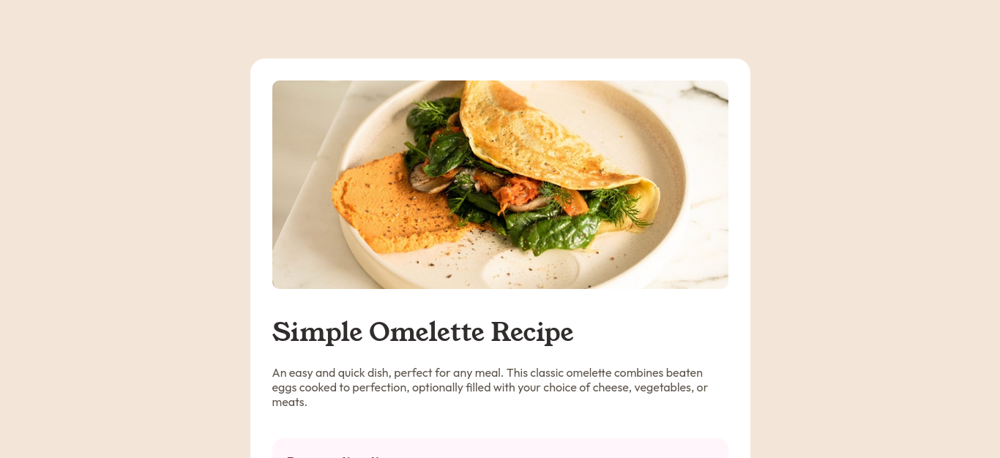

# Frontend Mentor - Recipe page solution

This is a solution to the [Recipe page challenge on Frontend Mentor](https://www.frontendmentor.io/challenges/recipe-page-KiTsR8QQKm). Frontend Mentor challenges help you improve your coding skills by building realistic projects. 

## Table of contents

- [Overview](#overview)
  - [The challenge](#the-challenge)
  - [Screenshot](#screenshot)
  - [Links](#links)
- [My process](#my-process)
  - [Built with](#built-with)
  - [What I learned](#what-i-learned)
  - [Continued development](#continued-development)
- [Author](#author)

## Overview

### Screenshot

### Links

- Solution URL: [Solution URL here](https://www.frontendmentor.io/solutions/responsive-recipe-page-using-html-and-css-vO37hwGsRX)
- Live Site URL: [Recipe Page](https://recipe-page-theta-coral.vercel.app/)

## My process

### Built with

- Semantic HTML5 markup
- CSS custom properties
- Flexbox
- Mobile-first workflow

### What I learned

In this challenge, I learned to apply class names in a better way. However, I think is only the beginning of improving my layout and association naming skills.

### Continued development

I would like to improve my methodology for naming classes in CSS. Additionally, I want to enhance my list styling skills.

## Author

- Frontend Mentor - [@INSolisLoyo](https://www.frontendmentor.io/profile/INSolisLoyo)
- LinkedIn - [@irma-nohemi-solis-loyo](https://www.linkedin.com/in/irma-nohemi-solis-loyo/)

